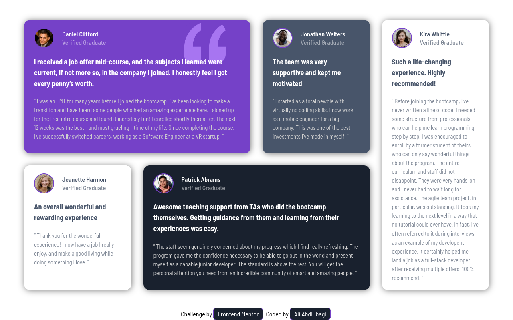

# Frontend Mentor - Testimonials grid section solution

This is a solution to the [Testimonials grid section challenge on Frontend Mentor](https://www.frontendmentor.io/challenges/testimonials-grid-section-Nnw6J7Un7). Frontend Mentor challenges help you improve your coding skills by building realistic projects. 

## Table of contents

- [Overview](#overview)
  - [The challenge](#the-challenge)
  - [Screenshot](#screenshot)
  - [Links](#links)
- [My process](#my-process)
  - [Built with](#built-with)
  - [What I learned](#what-i-learned)
  - [Continued development](#continued-development)
  - [Useful resources](#useful-resources)
- [Author](#author)
- [Acknowledgments](#acknowledgments)


## Overview

### The challenge

Users should be able to:

- View the optimal layout for the site depending on their device's screen size

### Screenshot
mobile 


dekstop


### Links

- Solution URL: [Add solution URL here](https://your-solution-url.com)
- Live Site URL: [Add live site URL here](https://your-live-site-url.com)

## My process

### Built with

- Semantic HTML5 markup
- CSS custom properties
- CSS Grid
- Flexbox

### What I learned
1. using `minmax()` function
2. orgnaize sass structure


### Useful resources

- [Deep dive into minmax() by ahmed shaded](ishaded.com/article/css-grid-minmax)) - This helped me for : 
1. using minmax()
- [Fluid typography tool](fluidtypography.com) - This is amzing tool for responsive typography using ```clamp()``` function

## Author

- linkedIn - [Ali AbdElbagi](https://www.linkedin.com/in/ali-abdelbagi-0231b223)
- Frontend Mentor - [Ali AbdElbagi](https://www.frontendmentor.io/profile/ali007-depug)
